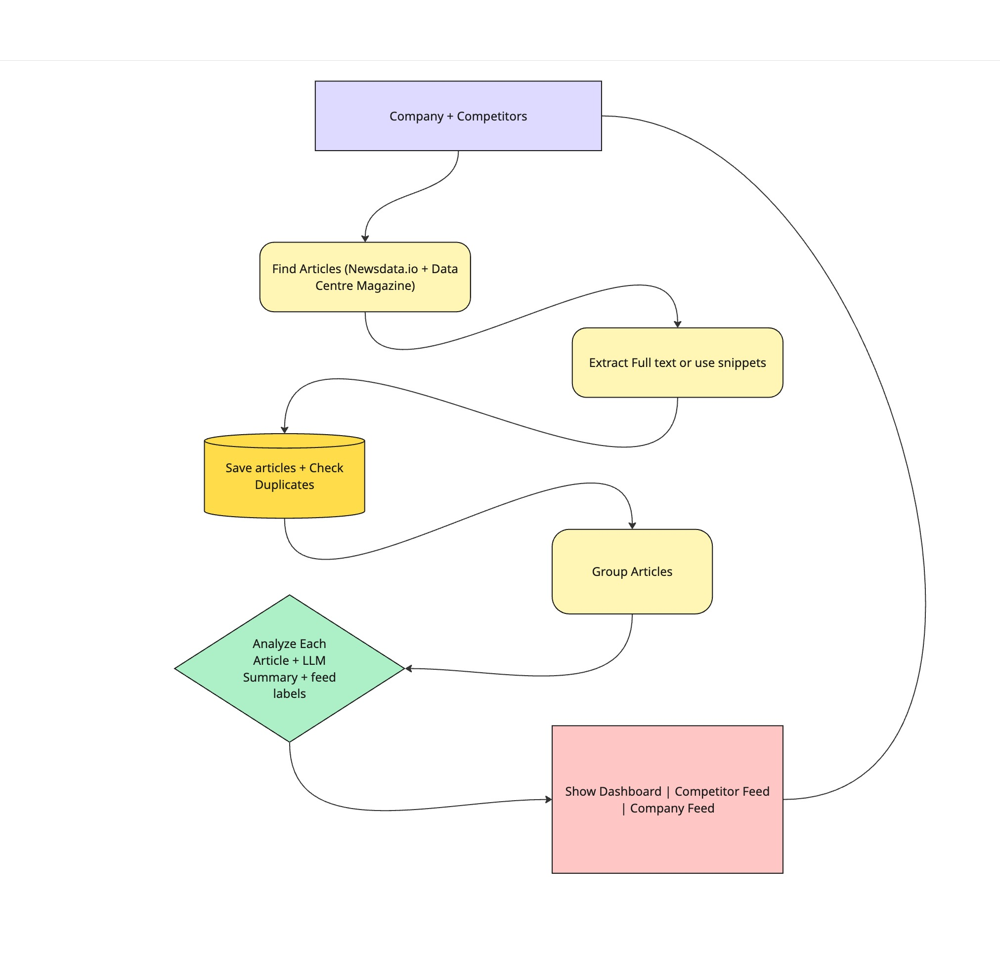

# PR News Monitor

A dashboard for tracking Equinix, competitor news, and general industry developments. It combines related coverage into stories, generates short summaries, and provides company, competitor, industry, and competitor-exclusive (Rival moves) feeds with links to the original articles.

Built with **Streamlit, SQLite, NewsData.io, Newspaper4k, and OpenRouter** for the [coding challenge](docs/task.md).

## Quick start

Create `.env` from `.env.example` if you don't already have one. Set `NEWSDATA_API_KEY` and `OPENROUTER_API_KEY`; the default model is `openai/gpt-4o-mini`. Optionally set `OPENROUTER_FALLBACK_MODEL` to a second model that is tried once when the primary fails, under the same prompt and validation.

```sh
docker compose up --build -d --wait
```

Open [localhost:8501](http://localhost:8501) and select **Refresh news**. Missing API keys are allowed; the dashboard shows unavailable integrations and labels fallback results.

- **Configure:** edit `config.yaml` to change tracked companies, aliases, and article limits, then run `docker compose restart app` and refresh.
- **Update credentials:** edit `.env`, then run `docker compose up -d --force-recreate --wait`.
- **Keep results:** SQLite lives in a named Docker volume and survives container recreation. `docker compose down --volumes` deletes saved coverage.

### Local development

Use Python 3.12 and the same `.env` configuration:

```sh
python3.12 -m venv .venv
source .venv/bin/activate
python -m pip install -r requirements-dev.txt
python -m streamlit run app.py
```

Run `python -m pytest -q` for tests; no API keys or network are required. Local results are stored in `data/news.db`, separately from Docker's volume. Runtime dependencies are pinned in `requirements.lock`.

## How it works



```text
NewsData.io + Data Centre Magazine
  → discover articles → extract text → group related coverage
  → summarize and classify with OpenRouter → publish to SQLite
  → Streamlit company / competitor / industry / rival-moves feeds
```

`app.py` handles presentation. Modules in `monitor/` handle retrieval, extraction, grouping, analysis, and storage; `pipeline.py` coordinates each refresh.

Normalized URLs deduplicate articles. TF-IDF similarity groups related reports using title, body, date, and company overlap. Up to two LLM attempts (primary, then the configured fallback model) per changed story produce a description and per-article relevance labels, validated with Pydantic. Successful extractions and unchanged analyses are reused.

Refreshes are explicit. Browsing saved results makes no API calls, and completed story snapshots are published atomically. If all sources fail, the previous snapshot stays visible.

### Industry feed

The optional `industry` section in `config.yaml` defines the sector name and aliases. The default is data centres. Restart and refresh after changing it; remove the section to return to two feeds.

The model assigns an independent industry label for substantive sector developments, such as technology, regulation, market trends, and infrastructure risks. Stories can overlap company or competitor feeds when they also contain broader industry news. Unrelated stories stay hidden even when both company labels are false. Without AI analysis, whole-alias keyword matching supplies an explicitly labeled fallback and can include incidental mentions.

This feed reuses the existing article collection and analysis requests. General coverage mainly comes from Data Centre Magazine; NewsData.io continues to prioritize the configured companies. It is a bounded sample, not comprehensive industry discovery. For a different sector, additional discovery sources would be needed for broader coverage.

Startup adds the industry column to existing SQLite databases without deleting articles or snapshots. Old labels default to false, and the new configuration/prompt fingerprint requires fresh analysis. All 145 automated tests pass, including migration, industry-only stories, overlapping labels, two-model fallback, unrelated exclusions, and malformed model responses.

## Taking it to production

Start with a single container on persistent storage, behind HTTPS and authentication. Use managed secrets, API spending limits, database migrations, and tested backup/restore procedures. Confirm publisher access and retention requirements before broader use.

Move refreshes into a background worker with scheduling, durable job state, and bounded retries. Track source failures, refresh duration, snapshot age, extraction success, model failures, and API cost; alert when coverage becomes stale. The current health check only verifies that the web server responds.

Before adding replicas, move storage to PostgreSQL and replace the process-local refresh lock with shared job coordination. The current SQLite setup and lock support one application process.

## What I'd improve with more time

1. **Measure quality:** label a representative news sample to evaluate grouping, relevance, and summary accuracy. Investigate provider timestamps that make old events appear recent.
2. **Improve coverage:** retry failed extraction, periodically re-fetch successful articles for corrections, and add sources where coverage is missing.
3. **Support daily use:** add saved filters, story history, corrections, and an in-app settings editor. Add retention cleanup for accumulated articles.

## Trade-offs made

| Choice | Benefit | Cost |
| --- | --- | --- |
| Streamlit + synchronous refresh | Small implementation and deployment surface | Long refreshes occupy the initiating session |
| SQLite + plain Python functions | Persistent storage without another service or ORM | Limited write concurrency; no multi-replica coordination |
| TF-IDF grouping | Deterministic, inexpensive, and inspectable | Can miss paraphrases or merge similarly worded events |
| Bounded retrieval and model context | Predictable latency and API spend | Coverage is sampled; excerpts may omit useful evidence |
| Analysis cache in published snapshots | Reuses existing storage | A run that fails before publication can lose paid analysis work |

## Scaling, reliability, and UX

- **Scaling:** refresh work is capped, including 200 recent articles for grouping and 20 stories per refresh (up to 2 model attempts each). Larger workloads need incremental processing, queued jobs, and provider-aware rate limits.
- **Reliability:** timeouts, bounded retries, independent source outcomes, and atomic publication limit the impact of failures. A second configured model is tried once before falling back to a headline and keyword relevance; schema validation cannot guarantee factual accuracy.
- **UX:** progress, partial coverage, fallbacks, snippet-only evidence, and unknown dates are visible. Background refresh and a clearer freshness indicator would make continuous monitoring easier.
- **Coverage:** the default seven-day window filters saved articles; it does not guarantee seven days of source history. Sitemap discovery is a bounded sample, so relevant news can be missed.

## Architecture and model choices I'd revisit

Keep Streamlit while the product is a small internal dashboard. Revisit a separate API and frontend when richer interactions, multiple teams, or independent UI scaling justify the extra complexity.

Benchmark the configured `openai/gpt-4o-mini` against alternatives using factuality, relevance accuracy, latency, and cost. Choose a model from measured results. Likewise, evaluate embeddings or a second-stage grouping verifier only after a labeled dataset shows where TF-IDF falls short.

Use the [interactive HTML presentation](docs/presentation/pr-news-monitor.html), [PowerPoint presentation](docs/presentation/pr-news-monitor.pptx), [five-minute speaking script](docs/walkthrough.md), and [short write-up](docs/short-write-up.md). The PowerPoint deck includes speaker notes. See [integration evidence](docs/integration-check.md) for recorded checks and [deployment notes](docs/deployment.md) for Docker details.
