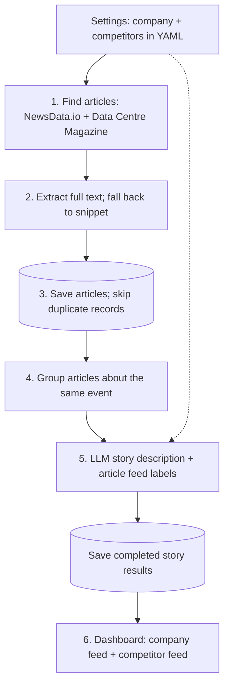

# PR News Monitor — implementation plan

Status: steps 1–5 complete; awaiting confirmation for step 6. See [integration evidence](docs/integration-check.md) and [implementation decisions](README.md).

## Goal and working agreement

Build a readable, locally running prototype within approximately four hours of implementation time. Prioritize the required source integrations, useful story grouping, grounded LLM analysis, and graceful failures. Use Equinix as the company and Digital Realty as the initial competitor.

Implement one numbered step at a time. Before moving to the next step, explain what changed, the important decisions and trade-offs, verification results, and any remaining limitations; wait for the user's confirmation. The time estimates below exclude approval waits. Do not silently expand scope when an integration is harder than expected.

## Agreed architecture

One Python application: Streamlit for the dashboard, SQLite for persistence, and ordinary functions connecting small processing modules. No separate API service, queue, vector database, or frontend build system.



Before extraction, check saved provider IDs and normalized URLs to avoid fetching known articles again. The diagram shows logical stages rather than every database lookup.

An article is one publication's coverage. A story contains one or more articles about the same event. Repeated records are removed; coverage from different outlets remains accessible inside its story. A story can belong to both feeds.

## Scope and explicit defaults

- Configuration lives in `config.yaml`. Display the active company and competitors in the UI, with a Refresh news button. Editing YAML requires an application restart.
- API keys live in environment variables. Never put keys in YAML, source control, UI output, or logs.
- Start with English articles, a seven-day local retention/display window, and at most 25 discovered articles per source per refresh. Step 1 verified that NewsData.io's latest endpoint covers up to 48 hours with a 12-hour free-plan delay; the app cannot promise seven-day backfill on first launch. See the integration evidence for query and pagination limits.
- Keep articles with missing dates, mark their date as unknown, and use discovery time only for internal retention. Do not present discovery time as publication time.
- Run a bounded, synchronous refresh with progress feedback. Dashboard reruns read stored results and never automatically fetch news.
- Use full text, when available, for grouping and LLM context. Record extraction status so snippet-only analysis is visible.
- Required LLM functions: story descriptions and article-level company/competitor relevance labels, batched per story. Derive story feed membership from its articles. Both/neither are valid outcomes.
- Docker and Docker Compose are the primary deployment deliverables. Streamlit Community Cloud is optional for sharing the demo, only after the required application and Docker verification are complete; it must not displace core implementation or testing time.
- Defer industry feed, sentiment, daily briefings, perspective synthesis, charts, editable settings, and production hosting.

Example configuration:

```yaml
company:
  name: Equinix
  aliases: [Equinix]
competitors:
  - name: Digital Realty
    aliases: [Digital Realty, Digital Realty Trust]
news:
  language: en
  recent_days: 7
  max_articles_per_source: 25
```

Validate nonempty names/aliases and reasonable positive limits at startup. Reject duplicated entities after case normalization. Keep matching rules separate from discovery queries.

## File responsibilities

```text
app.py                    Dashboard, progress, refresh action
config.yaml               Non-secret company and retrieval settings
monitor/
  config.py               Configuration loading and validation
  models.py               Small shared article/story data structures
  sources.py              NewsData.io and magazine discovery functions
  enrichment.py           Safe bounded retrieval and text extraction
  http.py                 Shared public HTTP retrieval and URL normalization
  grouping.py             Text similarity and story membership
  analysis.py             OpenRouter request, validation, fallback
  storage.py              SQLite schema, queries, transactions
  pipeline.py             Refresh orchestration and partial failures
tests/                    Focused behavior tests and small fixtures
requirements.txt          Verified dependency versions
.env.example              Required variable names and sample defaults
.gitignore                Secrets, local database, caches
Dockerfile
docker-compose.yml
README.md
```

Avoid generic plugin interfaces or repository classes. Split `sources.py` only if its two integrations become difficult to read together.

### Dependency boundaries

The file split must also enforce separation of behavior:

- **UI (`app.py`):** render data, collect the refresh action, and translate progress/results into Streamlit messages. No SQL, article fetching, grouping rules, or LLM prompts here.
- **Application (`pipeline.py`):** coordinate refreshes, limits, failure handling, and persistence through ordinary Python function calls. Accept validated configuration and return a structured refresh result. If live progress is needed, accept a simple optional callback carrying plain progress data; never call Streamlit directly.
- **Processing and integrations:** source retrieval, extraction, grouping, and analysis receive explicit inputs and return ordinary data structures. Grouping has no network or database access. Integration modules own their provider-specific request/response handling.
- **Storage (`storage.py`):** own SQL, connection handling, and transaction boundaries. Expose small concrete functions for saving articles, publishing stories, and reading dashboard results; callers do not manipulate SQL or database rows directly.
- **Shared data (`models.py`):** contain plain typed data structures with no UI, network, or database side effects. Configuration and credentials are resolved at startup and passed explicitly; an optional Cloud secrets adapter belongs at the application entry point.
- Nothing inside `monitor/` imports `streamlit` or `app.py`, uses `st.session_state`, or depends on Streamlit caching. Streamlit-specific rendering and resource caching remain in `app.py`.

Dependency direction: `app.py → pipeline.py → processing/integration modules + storage.py`. The UI may also call storage read functions for saved dashboard results. Shared models/configuration support these calls without depending on the UI.

**Verification:** run a refresh against fixtures and a temporary SQLite database from a normal Python test without launching Streamlit or creating a Streamlit session. This proves the processing can later be called from FastAPI or a scheduled command. Replacing SQLite with PostgreSQL would still require deliberate SQL/schema work in storage; this plan does not promise a zero-effort database swap or add an abstraction framework for it.

## Implementation steps — 240 minutes total

### Step 1 — Prove external access (25 minutes)

Completed: both sources, Newspaper4k extraction, and a structured OpenRouter response verified locally. Docker daemon unavailable; container verification remains in step 7. Details: [integration evidence](docs/integration-check.md).

- Read current official documentation for NewsData.io and OpenRouter. Confirm authentication, response shape, pagination, quotas, model availability, and supported structured-output behavior.
- Check whether API keys are available without printing their values. The task mentions keys but contains none. If missing, request them through local environment setup; do not ask for secrets in chat. Continue independent local work with clearly identified fixtures.
- Investigate Data Centre Magazine discovery: available feed, sitemap, or public listing. Test retrieval of at least one real article and check whether extraction is possible.
- Select the simplest working public discovery method and a text-extraction library based on this spike. Evaluate Newspaper4k first; use an alternative if installation or extraction materially complicates the prototype.
- Confirm a small OpenRouter response with a suitable available model; keep its identifier in environment configuration.

**Exit evidence:** record actual working access paths, sample field shapes, and limitations. A blocked magazine source is an unresolved requirement, not a completed integration. Surface it at this checkpoint and agree on the next approach before spending more time. Do not assume a feed exists or promise a protection workaround.

### Step 2 — Configuration and persistence (25 minutes)

Completed: validated YAML, immutable shared models, concrete SQLite functions, and focused tests. Storage preserves useful article content, maps overlapping provider identities, isolates configuration snapshots, and publishes stories atomically. Setup and decisions are documented in [README.md](README.md). No Streamlit dependency or API calls are required to exercise this layer.

- Create the minimal project layout, dependencies, environment example, and YAML validation.
- Define simple article/story structures and SQLite tables.
- Persist articles with internal ID, provider identity when available, URL, title, snippet, publisher, publication/discovery times, extracted text, extraction status, and a content fingerprint.
- Store stories and their article membership, validated analysis, analysis status, input fingerprint, and active configuration fingerprint.
- Store latest refresh attempt and source outcomes separately from latest successful result publication.
- Use unique constraints and upserts for repeat ingestion. Preserve useful stored content when an incoming record has missing fields.

**Exit evidence:** valid configuration loads; invalid configuration has a useful error; duplicate insertion does not create another record; a database reopen preserves data. Keep schema initialization simple; no migration framework for the initial prototype.

### Step 3 — Discovery and full-text enrichment (45 minutes)

Completed: bounded NewsData.io pagination, magazine sitemap discovery, shared validated-IP retrieval, extraction with snippet fallbacks, and incremental ingestion persistence. A live six-article check extracted all six and reused them on the next run. Focused tests cover source failures, malformed responses, unsafe redirects, parser network isolation, and time budgets. Operational limits and remaining gaps are documented in [README.md](README.md).

- Implement both source integrations proven in step 1, with bounded pagination and article counts.
- Normalize provider fields into the common article structure, including UTC dates and missing-field fallbacks.
- Deduplicate by provider identity and conservatively normalized URL before enrichment. Remove fragments and known tracking parameters; preserve query parameters that might identify content.
- Fetch unknown articles with explicit timeouts, bounded response size, and redirect limits. Permit only HTTP(S), reject private/local destinations, and revalidate redirect targets using a controlled retrieval path. Do not let an extraction library perform an unrestricted second fetch.
- Reject obvious empty, consent, or boilerplate extraction results. Use snippets on failure and preserve the reason.
- Persist successful article work even when another article or source fails. Retry transient failures at most once when the refresh deadline permits; honor rate-limit delays only within that deadline. Avoid retries for authentication errors and blocked/paywalled pages.

**Exit evidence:** both sources supply real articles where access is available; a failed fetch still leaves usable metadata; repeated discovery avoids duplicate rows and unnecessary extraction. Show one actual extracted article and one controlled failure case.

### Step 4 — Conservative story grouping (30 minutes)

Completed: TF-IDF title/body similarity, date and company-overlap guards, fixed representatives, deterministic membership IDs, and bounded recent-window reads. A 12-article live sample produced 11 groups, retaining matching coverage from two outlets together. Focused tests cover full-text contribution, unrelated events, transitive bridging, missing dates, limits, and order stability. Thresholds and known limitations are documented in [README.md](README.md).

- Rebuild stories from the bounded recent article window, rather than maintaining incremental cluster merges and splits.
- Start with TF-IDF cosine similarity over titles plus a bounded, lower-weight portion of full text or the snippet. Use title emphasis and a date-proximity restriction; tune the threshold against examples rather than treating an arbitrary value as correct.
- Use deterministic ordering and compare candidates to a fixed representative of each group, avoiding unrestricted transitive chaining. Limit cluster size/context to prevent unbounded downstream work.
- Keep singleton stories. Do not group solely because articles share a company name. For missing publication dates, use stricter similarity and document the uncertainty.
- Preserve original articles and publishers inside each group. Cap the active processing window separately from stored history.

**Exit evidence:** inspect a handful of real groups and test same-event wording variations, unrelated events about the same company, and a bridging article. Record likely false merges/splits. Explain that rebuilding is simple but can change membership as new articles arrive.

### Step 5 — Grounded LLM analysis (35 minutes)

Completed: bounded OpenRouter calls, strict local schema/article-ID validation, multi-label article relevance, explicit fallbacks, successful snapshot-based analysis reuse, and full refresh publication. A live run generated five valid analyses from six articles; the next refresh reused all five with zero model requests. API errors, invalid output, budgets, fallback retry, and snapshot preservation are covered by tests. Decisions and remaining limitations are documented in [README.md](README.md).

- Send each story's article IDs, titles, publishers, and bounded extracted text/snippets to OpenRouter.
- Request a short factual story description and relevance labels for each provided article. Enforce a local output schema, allowed labels, and exactly the expected article IDs, regardless of provider-side format enforcement.
- Treat article contents as untrusted data, not instructions. Ask the model to use only supplied evidence and avoid unsupported interpretation.
- Allow company, competitor, both, or neither. Aggregate article labels into story feed membership; omit irrelevant stories from the two main feeds.
- Cache successful results using a stable fingerprint of sorted article membership, supplied content, configuration, model, and prompt version. Reuse unchanged analysis after regrouping.
- On timeout, invalid output, or service failure, use the representative title as a clearly marked fallback description and conservative alias matching as fallback labels. Do not cache a transient fallback as permanent success.
- Bound calls and total text per refresh. Publish the completed story snapshot and membership atomically; preserve the previous snapshot if publication fails.

**Exit evidence:** a live LLM description and classification work; malformed output and timeout use honest fallbacks; a dual-company story can enter both feeds; changed content/configuration invalidates cached analysis.

### Step 6 — Dashboard and refresh behavior (30 minutes)

- Show read-only configuration, Refresh news, progress, last successful update, and latest source outcomes.
- Show company and competitor feeds with stories ordered by their newest known article publication date; place unknown-date stories after dated stories.
- Each story shows its description and expandable original coverage. Every article exposes title/link, description or explicit missing-description fallback, publisher, and publication date or “Unknown”.
- Distinguish no matching news, never refreshed, partially successful refresh, and complete retrieval failure.
- Use one application-wide refresh guard across Streamlit sessions, released in `finally`; disable the initiating button while active. State the single-process deployment assumption.
- On configuration change, do not show stories classified under the old configuration as current results. Explain that a refresh is needed; reuse saved articles where applicable.
- Display snippet/fallback indicators without overwhelming the user with technical details. Render text safely without unsafe HTML.

**Exit evidence:** normal UI reruns cause no API calls; repeated clicks do not overlap refreshes; saved results remain available after restart; source failures and empty states are distinguishable.

### Step 7 — Packaging, verification, and interview walkthrough (25 minutes)

- Add a reproducible Dockerfile with a pinned Python version and verified dependency versions. Run Streamlit as a non-root user, bind to `0.0.0.0`, expose port 8501, and configure a health check.
- Add Compose with runtime environment configuration and a named volume for SQLite. Ensure the non-root application user can write to the volume. Add `.dockerignore` to exclude secrets, local databases, Git metadata, and caches; never bake API keys into the image.
- Document local and Docker setup, API/model variables, YAML changes, refresh limits, source coverage, and verified limitations.
- Run focused tests and one complete refresh. Build and start with `docker compose up --build`, verify application health and dashboard access, and confirm the integrations work inside the container. Recreate the container and confirm saved results survive in the named volume. If the local Docker runtime is unavailable, explicitly report these checks as unverified; do not describe Docker deployment as verified.
- Document production improvements and trade-offs below, with a five-minute walkthrough outline.

**Exit evidence:** a reviewer can follow setup instructions, open the dashboard, see real sourced stories, and understand how failures are handled. Do not claim live integration success from mocked tests. If a mandatory integration remains blocked, name the incomplete requirement clearly.

### Step 8 — Contingency and final review (25 minutes)

Reserve this time for integration problems, grouping mistakes discovered with real news, packaging fixes, and rehearsing the walkthrough. Do not spend it adding optional features while requirements remain incomplete.

### Optional follow-up — Streamlit Community Cloud demo

This is a low-priority demo convenience, outside the required implementation steps. Attempt it only when the core prototype and Docker deliverables are complete and time remains. Community Cloud deploys the Python app from GitHub; Docker remains the primary reproducible deployment path.

- Deploy `app.py` with the same configuration and verified dependencies; add system dependency declarations only if the chosen extractor requires them.
- Configure API credentials through Community Cloud Secrets without committing secret files. Keep business configuration in YAML.
- Treat SQLite on Community Cloud as a rebuildable cache. Local filesystem persistence is not guaranteed: initialize safely when the database is absent and show an honest empty state until Refresh succeeds. Docker's named volume remains the intended persistent local deployment storage.
- State that the demo is on demand and may sleep; it is not a continuous monitoring deployment.
- Verify both sources and OpenRouter from the cloud runtime, particularly magazine access, rather than assuming local scraping success transfers to cloud hosting.
- Apply a shared refresh cooldown to limit repeated API calls by demo visitors, in addition to the refresh concurrency guard.
- Verify initial startup, a successful refresh, partial-failure feedback, and recovery from an empty database. Document any cloud-specific limitations.

References: [Community Cloud deployment](https://docs.streamlit.io/deploy/streamlit-community-cloud/deploy-your-app/deploy), [secrets](https://docs.streamlit.io/deploy/streamlit-community-cloud/deploy-your-app/secrets-management), [local storage limitations](https://docs.streamlit.io/develop/concepts/connections/connecting-to-data), and [app hibernation](https://docs.streamlit.io/deploy/streamlit-community-cloud/manage-your-app).

## Important failure policies

| Situation | Expected behavior |
|---|---|
| One source fails | Continue the other; display partial coverage and retain useful prior results. |
| All sources fail | Keep the last published results; report the failed attempt without advancing the successful update time. |
| No new articles | Reuse stored articles/analysis; do not imply retrieval failed. |
| Full text is unavailable | Retain metadata and snippet; mark extraction status. |
| Same event, different outlets | Group coverage and preserve source links. |
| Same article rediscovered | Update the existing record without duplicating it. |
| Article mentions both tracked entities | Permit both feed memberships. |
| LLM result is unusable | Show labeled fallback analysis; allow a later retry. |
| Configuration changes | Recompute relevance and analysis for that configuration; never silently reuse incompatible results. |
| Process stops mid-refresh | Already saved articles survive; previously committed story results remain valid. |
| Missing or invalid dates | Show “Unknown”; do not fabricate a publication timestamp. |
| Quota or refresh deadline reached | Stop further work predictably and report limited coverage. |

## Verification priorities

Use small fixtures and mocked external failures for deterministic tests; real source smoke checks verify integration separately.

1. Repeated ingestion and URL normalization, including meaningful query parameters.
2. Partial source failure and preservation of previous successful results.
3. Extraction fallback and rejection of unsafe/redirected destinations.
4. Same-event grouping, unrelated company events, and transitive bridging.
5. Both-feed and neither-feed classification, invalid LLM output, and unknown article IDs.
6. Analysis cache invalidation when story membership, content, or configuration changes.
7. Atomic story publication and the refresh guard, plus manual UI restart/rerun checks.

Tests should protect these behaviors, not mirror every helper implementation. Broad browser automation and exhaustive provider edge-case coverage are outside this time budget.

## Trade-offs to explain in the interview

| Choice | Benefit | Limitation / future trigger |
|---|---|---|
| YAML configuration | Meets the requirement with little UI complexity. | A settings UI becomes useful for nontechnical users. |
| Streamlit + synchronous refresh | Fast implementation, one Python runtime. | Longer jobs or multiple users justify background execution. |
| SQLite | Durable local results and simple deployment. | Multiple application replicas need shared storage and distributed job coordination. |
| TF-IDF and conservative grouping | Low cost, deterministic, inspectable. | Paraphrases and ambiguous events may need embeddings or a second-stage verifier after evaluation. |
| Rebuild a bounded recent window | Avoids incremental clustering complexity. | Membership can change; larger history would require a different strategy. |
| LLM analysis once per changed story | Satisfies summary and extra analysis requirements with fewer calls. | Quality depends on supplied text, context limits, and model behavior. |
| Snippet fallback | Preserves coverage when extraction fails. | Summaries may be incomplete and must not imply full-text coverage. |
| Bounded retrieval | Predictable latency and API usage. | Feeds are a recent sample, not an exhaustive monitoring service. |

## Production discussion, not prototype scope

- Scheduled background ingestion with durable retries, per-source throttling, and explicit service-level expectations.
- PostgreSQL and shared refresh coordination when deploying multiple workers/replicas.
- Source access/licensing and content-retention policies before storing full text at scale.
- Structured operational metrics for source health, extraction success, refresh latency, cost, and fallback rates.
- A labeled evaluation set for grouping and relevance, followed by evidence-based model/embedding changes.
- Authentication, stronger network egress controls, secrets management, and dependency maintenance before public deployment.
- Stable story history, correction handling, retention cleanup, and settings UI when required by real users.

## Five-minute walkthrough

1. **0:00–1:00:** Show the configured company, both feeds, one multi-source story, and its original coverage.
2. **1:00–2:00:** Explain discovery, full-text enrichment, persistence, grouping, and LLM analysis using the diagram.
3. **2:00–3:00:** Demonstrate or describe one controlled failure and the visible fallback; show refresh/source status.
4. **3:00–4:00:** Explain why YAML, SQLite, Streamlit, and deterministic grouping fit the time budget.
5. **4:00–5:00:** Show focused verification, deployment instructions, known limitations, and the next production improvements.

## Next confirmation

Review the step 5 implementation and verification, then authorize step 6: the Streamlit dashboard, refresh guard, and visible status/fallback handling. Docker packaging remains step 7.
